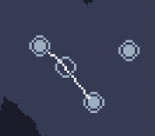
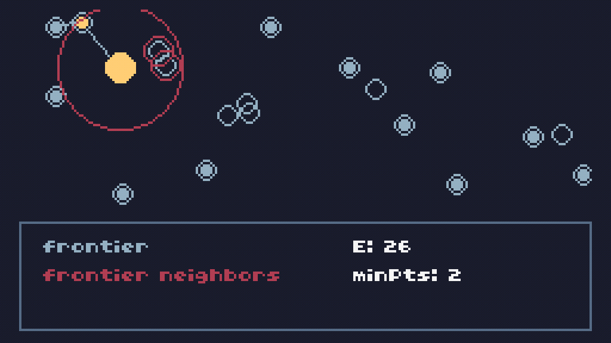
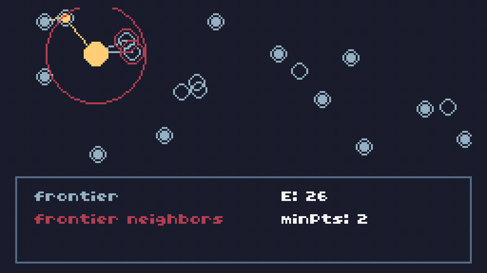
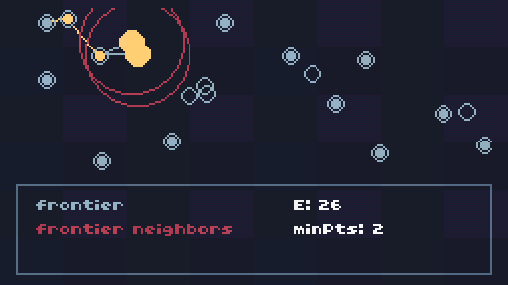
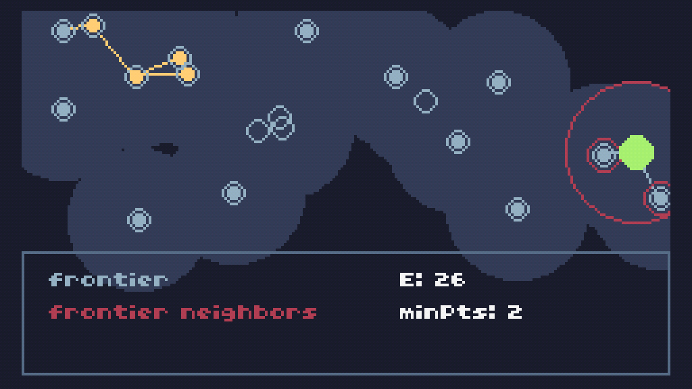
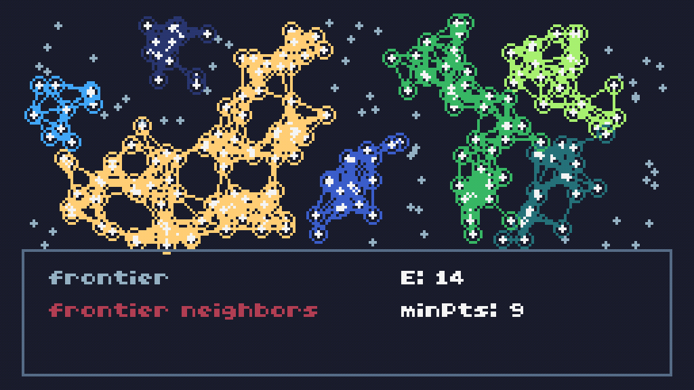

# Machine Learning on the TIC-80: DBSCAN

DEMO: https://rmorais.itch.io/tic80-dbscan

## Intro

DBSCAN is a clustering algorithm that makes use of a network data structure to find patterns in data.

It takes-in three inputs:

1. $\epsilon$: the maximum distance between two points for them to still be considered neighbors
2. $minPts$: the minimum number of neighbors a point needs to be considered a _core point_ (a term we will make sense of later)
3. The data itself

$$\text{DBSCAN}(data,\epsilon,minPts)$$

Here, I will be demonstrating the algorithm using a visualization built usign the TIC-80 fantasy console.

## Point Class

A point will contain the following properties:

- `vec`: a 2D position vector
- `cluster`: the cluster it belongs to, which is initialized to $-1$ (meaning it belongs to no cluster)
- `neighbors`: an array with references to points that neighbor the point
- `isCore`: a boolean representing if the point is a core point or not

Here is what the type hints and the constructor look like for the point 'class':

```lua
---@class Point
---@field cluster number
---@field vec Vectic
---@field neighbors Point[]
---@field isCore boolean

---@type fun(v:Vectic):Point
function NewPoint(v)
 return {
  vec=v,
  cluster=-1,
  neighbors={},
  isCore=false
 }
end
```

[Vectic](https://github.com/rodigu/vectic) is a TIC-80 library for vector operations. It will assist in some of the operations necessary for making the algorithm work.

## DBSCAN: Step-by-Step

### Neighborhood

The DBSCAN algorithm starts by adding neighbors to the points using the parameter $\epsilon$ as a maximum distance to connect points.


In the image, the dark gray circles represent the area within $\epsilon$ distance of a given point. Other points found within that area of influence are added to a point's neighborhood, represented here as lines between the points.

The following function sets the neighbors of the point in index `idx` of the point table `points`, using `dist` as a maximum distance for a point to be considered a neighbor.

```lua
---@type fun(idx:number,points:Point[],dist:number)
function setNeighbors(idx,points,dist)
 local point=points[idx]
 point.neighbors={}
 for i,p in pairs(points) do
  if i~=idx and point.vec:dist2(p.vec)<=dist*dist then
   table.insert(point.neighbors,p)
  end
 end
end
```

### Core

Then, the algorithm defines core points, which are defined as points with at least $minPts$ number of neighbors.



For instance, here we see a point with 2 neighbors that is classified as a core point. Visually, core points are being represented as empty circumferences.

The following core runs through the points in the table `points`, and uses `minPts` to define how many neighbors a point needs to be considered a core point. It then returns a table with references to the core points:

```lua
---@param points Point[]
---@param minPts number minimum number of neighbors to define a core point
function getCorePts(points,minPts)
 ---@type Point[]
 local core={}
 for _,p in pairs(points) do
  if p.cluster==-1 and #p.neighbors>=minPts then
   table.insert(core,p)
   p.isCore=true
  end
 end
 return core
end
```

### Cluster Expansion

A random core point is selected and assigned a cluster. In this case, the algorithm selected a yellow a core point in the top left:


The cluster expands using a "frontier" consisted of points on the edge of the cluster that are also core points.



Points that are not part of the core are still added to the cluster, but the aren't added to the frontier, and thus can't further expand the cluster.

In the previous image, we could see the frontier point (highlighted in yellow), its area of influence (the large red circumference), and the points that fall under that influence (surrounded by a small red circumference).

The points within distance $\epsilon$ of the frontier points are then added to the same cluster as the frontier:



The next points in the frontier don't have any further connections to make, so the cluster is completed:



The algorithm then selects another random core point that isn't already in a cluster and repeats all steps for the new cluster:



Here is what it looks like:


And here is the code for cluster expansion:

```lua
---@param point Point
---@param recursive? boolean
---@return Point[]
function expandCluster(point,recursive)
 ---@type Point[]
 local frontier={}
 for _,p in pairs(point.neighbors) do
  if p.cluster==-1 then
   p.cluster=point.cluster
   if p.isCore then table.insert(frontier, p) end
   if recursive and p.isCore then expandCluster(p) end
  end
 end
 return frontier
end
```

And here are a couple of runs of the algorithm:


